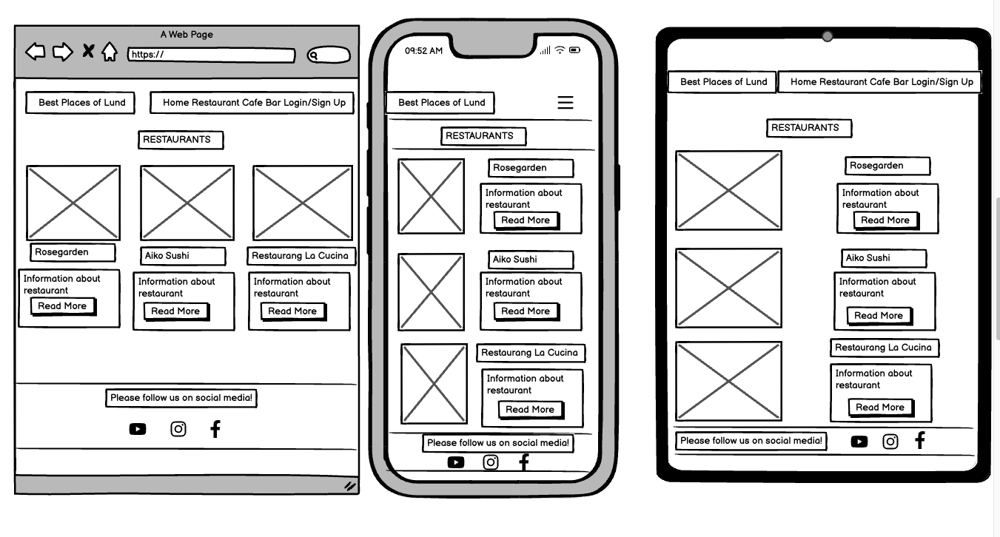

 # About 

This is a platform where everyone can share, post, comment and like restaurants, cafes and bars in Lund/Sweden. Its purpose is to help users share their experiences, discuss their ideas, and choose a venue if they wish based on the comments they see.

    ADD AM I RESPONSIVE SCREENSHOT !!!!
    
The Live Site can be found [here.](https://merve-project-4-dfec2093a369.herokuapp.com/)  

# Table of Contents
- [About](#about)
- [Table of Contents](#table-of-contents)
  - [User Experience](#user-experience)
  - [Admin](#admin)
  - [Member User](#member-user)
  - [General User](#general-user)
  - [Features](#features)
    - [Existing Features](#existing-features)
  - [Future Features](#future-features)
  - [Wireframes](#wireframes)
  - [Structure](#structure)
  - [Databases](#databases)
    - [Post Model](#post-model)
    - [Comment Model](#comment-model)
  - [Technologies Used](#technologies-used)
    - [Frameworks, Libraries \& Tools Used](#frameworks-libraries--tools-used)
  - [Testing](#testing)
- [Unit Testing](#unit-testing)
  - [Testing Views:](#testing-views)
  - [Testing Models:](#testing-models)
  - [Testing Models:](#testing-models-1)
  - [W3C Markup Validation Service](#w3c-markup-validation-service)
  - [CSS Validation Results](#css-validation-results)
  - [PEP8 Python Validator](#pep8-python-validator)
  - [BUGS](#bugs)
  - [User Story Testing](#user-story-testing)
  - [Deployment](#deployment)
      - [Create the Heroku app](#create-the-heroku-app)
      - [Attach the Database:](#attach-the-database)
  - [Credits](#credits)
  - [Acknowledgements](#acknowledgements)

## User Experience 

I designed this platform with desgin thinking approach. With only the necessary content/information. User can surf the site easily and get the information they are looking for. Please find all my defined user stories [here](https://github.com/mervecoskunn/project-portfolio-4/issues)

## Admin

  * As a Site Admin I can approve or disapprove posts so that I can filter out objectionable posts.
  * As a Site Admin I can create, read, update and delete posts so that I can manage my blog content.
  * As a Site Admin I can approve posts before it is published so that the site content will be consistent.

## Member User
  
  * As a Member User I can register an account so that I can manage my posts, comment and like.
  * As a Member User I can post/add/edit/delete posts so that I can share and manage my posts.
  * As a Member User I can like or unlike a post so that I can interact with the content.
  * As a Member User I can leave comments on a post so that I can be involved in the conversation.
  * As a Member User I can view my posts status of approval so that I can manage my posts.

## General User 
  
  * As a Site User I can view a list of posts so that I can select one to read.
  * As a Site User I can click on a post so that I can read the full text.
  * As a Site User / Admin user I can view comments on an individual post so that I can read the conversation.
  * As a Site User / Admin I can view the number of likes on each post so that I can see which is the most popular or viral.

## Features

### Existing Features 

- Home Page
  - Three posts representing categories were shared on the home page, so that users could access short and clear information about the site, and were supported with visuals. If the user wishes, they can easily list the posts belonging to the relevant category by clicking the button below. A short and clear guidance has been added on the screen so that they can Login/Register and like comments.
  
  

  - When the visitor clicks on any category selected, it goes to the relevant category. 

  

  - Visitor can create an account by clicking on login/register from the menu or from the button below.
    
  

  

- Categories
  
  - When visitors click on the categories option in the menu, we encounter a dropdown menu and from there the visitors can select the option visitor wants and list the relevant posts.
  
  

- Restaurant Cafe Bar Page
  
  - When the relevant category is selected, relevant posts are sorted.
   
   

- One Post Page
  
  - When visitor click on one of the listed posts, it will be seen in detail. If the visitor wants to comment or like, visitor must log in or register.
   
   

- Login Page
  
  - Visitor can login from the Login tab in the menu and comment, like or post can be shared.
  
  

- Register Page
  
  - A new account can be created from the register tab in the menu and thus can log in and use user features.
  
  

- My Page
 
  - On the My page, the user sees 3 buttons to navigate easily.
  - User can share new posts, view own posts, and edit or delete them if user wishes. If user clicks on the title of own post, user can view own post in detail.
  - User can log out using the logout button.
  
  

- Publish a Post 

  - Creating and adding a post by a registered user is possible.

  - The user can publish a post after signing in and from their profile page.

  - The user must enter a title, catogory, content and image.
  
  

  - Once the post is published, the post is submitted for approval to the admin. The submitted post can be viewed/edited/deleted by the owner from 'Manage my posts Page'.

- Manage My Posts Page
  
  - The user can see the list of their own posts from 'Manage My Posts' page
  - Each post listed has information about that particular post.
  - Post title, quote, and submission date/time are available separately for each submission.
  - Finally, buttons for editing and deleting options are provided for user management.
  - After the post is published, it is submitted to the administrator for approval. The submitted post can be viewed/edited/deleted by its owner from the 'Manage My Post'.
   
   

- Edit Page
   
  - The user can select the post user wants to edit and edit it.
  - The authenticated and owner of the post can only edit the post.
  - The posts that are selected for editing are prepopulated form that is ready for editing.

   
 
- Delete a Post

   - The authenticated and owner of the post can only delete the post.
   - The posts that are chosen to be deleted asks the user for confirmation by pop-up alert on the window.  
  
- Like and Comment on a Post 

  - All the site visiters can view the comments and the number of likes.

  - The unregistered site visiters cannot view the comment box to write a comment. Once they register, then it is visible for them and they can post a comment on any post they want.

- Logout
 
  - The user can logout from Menu and from their accounts page.

  - When the user wants to logout a pop-up modal is triggered for confirmation.

  - The logout modal asks the user if they confirm to logout. 
  
## Future Features

 - Connect with Google translate API, so users can submit posts from different languages and also translate to language they want.
  - Members can save posts that they like (in save category) and go back to read it later.
  - Users can set up their own profile page, add information about themselves, upload a profile picture and connect with other members.
  - Create a community group and vote for their own admin/admins to review their posts.
  
## Wireframes

  - Each pages wireframes includes mobile(small screen), tablet(medium screen), desktop(large screens).
    - Home Page:  
    

    - Login Page:
    

    - Register Page:
      

    - Category Page:
      

    - Post Page:
      

    - My Page:
      

    - My Posts Page:
      
    
    - Publish Post Page:
      
    
    - My Publish Page:
     
     
## Structure
 
The idea behind the structure of Best Places Of Lund was to simply guide users visiting the site in a clear and understandable way.
Color confusion and unnecessary information were avoided

Throughout the project development, GitHub projects is used. Click[here](https://github.com/users/mervecoskunn/projects/7) to view the process.

## Databases
!!!! DATABESE EKLE BURAYA !!!!

### Post Model

Post model handles posts details: title, content, date created/updated, featured image and likes. This post model handles the base for confirming user/author authentication to manage their own posts.

### Comment Model

Comment model handles the content of the comment, the username of the person commenting, date/time of commenting.

## Technologies Used
  * HTML
  * CSS
  * JavaScript
  * Python

### Frameworks, Libraries & Tools Used

  * Bootstrap 5 - grid, layout, columns, cards and forms structure.
  * Django - django frameworks to manage apps.
  * GitHub - to store the overall project repository.
  * GitPod - used as workspace to do the coding.
  * Balsamiq Wireframes - To design the wireframe of the complete project.
  * Google Fonts - Used for logo and all the written content.
  * Fontawesome - fontawesome icons for social media links and as additional design.
  * Heroku - for the deployement of the project.
  * Coolors - to choose the color palette and color shades.
  * PostgreSQL - database storage of the models.
  * Amazon - image and static files storage.
  * AmIResponsinve - responsiveness of the site.
  * Lighthouse - used for testing site functionality.
  * W3C Markup Validation Service - used for HTML testing.
  * W3C CSS Validation Service - used for CSS testing
  * PEP8 - used for Python files testing.

## Testing

# Unit Testing

I have used django TestCase for automated testing views, forms and models files.

## Testing Views:

- Tested if the views are funcitoning as expected and returns pages that the user needs to be at.
  - Testing Index/Home page view:
    

  - Testing Models:
    
    

  - Testing Profile Page View: 
    
    
 
  - Testing Adding Posts / Publish Posts Page View:
    
  
  - Result:
    
  
## Testing Models:

  - Models are tested while testing views and forms as well. But in addition, I tested if the models shows that featured image is a requirement and successfully sent to the database:
    - Result:
      

## Testing Models:
- Lighthouse
  - Testing results:
    

## W3C Markup Validation Service
- Home Page:
  - index.html:
   

  - pages/account/index.html:
    

  - pages/actions/post-create.html:
    

  - pages/actions/post-edit.html:
     

  - pages/actions/posts.html:
    

  - pages/categories/bar/index.html:
    

  - pages/categories/cafe/index.html:
    
  
  - pages/categories/bar/index.html:
    
  
  ## CSS Validation Results

  The CSS validation results for the files used in the project are as follows:
    - Styles.css:
     

  ## PEP8 Python Validator
  - No errors or warnings found.
   
  - models.py:
    
  
  - admin.py:
    

  - posts.url:
      

  - views.py:
    
  
  - forms.py:
    
   
  - test_views.py:
    
  
  - test_models.py:
    
  
  - views.py:
    

  - test_forms.py:
    

  - apps.py:
      
  
  - asgi.py:
    

  - project-urls.py:
    

## BUGS
 !!!!BURAYI YAP !!!

## User Story Testing

- Admin
  - As a Site Admin I can approve or disapprove posts so that I can filter out objectionable posts.

  - As a Site Admin I can create, read, update and delete posts so that I can manage my blog content.

  - As a Site Admin I can aproove Posts before it is published so that the site content will be consistent. 
   
    

  - Member User
    - As a Member User I can register an account so that I can manage my posts, comment and like.  
    

    - As a Member User I can post/add/edit/delete posts so that I can share and manage my posts.
      
  
    - As a Member User I can like or unlike a post so that I can interact with the content.

    - As a Member User I can leave comments on a post so that I can be involved in the conversation.
  
   

    - As a Member User I can view my posts status of approval so that I can manage my posts.
     

  - General User
    - As a Site User I can view a list of posts so that I can select one to read.
      
         
  
    - As a Site User I can click on a post so that I can read the full text.
     

    - As a Site User / Admin user I can view comments on an individual post so that I can read the conversation.
    - As a Site User / Admin I can view the number of likes on each post so that I can see which is the most popular or viral. 
    

  - Browser Compatability
    - Checked and verified that the site works on different browsers.
    - Safari:
     

  - Chrome:
    

- Responsiveness Testing

  - Desktop-Large Screen sizes:
  
  

  - Ipad - Medium Screen sizes:
  

  - Mobile - Small Screen Sizes:
  

## Deployment

This project was deployed to Heroku. "Heroku is a cloud platform that lets companies build, deliver, monitor and scale apps."[here](https://id.heroku.com/login)

- Steps to open account in Heroku:
  - [Signup here](https://signup.heroku.com/) if you do not have an account already.
  - 
  - After you fill in all the information for account and sign in, you will be on [Dashbord](https://id.heroku.com/login). Here is where you will create an application. 
  - Click on New => Create new app.
    
  - Choose a name to your application and select location that you are based.
  
- Steps to Deployment: 

I have followed Code Institute's [Django Blog Cheat Sheet](chrome-extension://efaidnbmnnnibpcajpcglclefindmkaj/https://codeinstitute.s3.amazonaws.com/fst/Django%20Blog%20Cheat%20Sheet%20v1.pdf) steps to follow, create and deploy the project on Herokuapps.
- Step 1: Installing Django and supporting libraries 
- In the terminal
     
  1. Install Django and gunicorn: pip3 install django gunicorn
  2. Install supporting libraries:	pip3 install dj_database_url psycopg2
  3. Install Cloudinary Libraries	pip3 install dj3-cloudinary-storage
  4. Create requirements file	pip3 freeze --local > requirements.txt
  5. Create Project	django-admin startproject PROJ_NAME . (Don’t forget the . )
  6. Create App	python3 manage.py startapp APP_NAME
  
  - In the setting.py
  
  7. Add to installed: apps	‘APP_NAME’,
   
  - In the terminal
  8. Migrate Changes: python3 manage.py migrate
  9. Run Server to Test: python3 manage.py runserver

- Step 2: Deploying an app to Heroku
  - Create the Heroku app
  - Attach the database
  - Prepare our environment and settings.py file
  - Get our static and media files stored on Cloudinary
  #### Create the Heroku app
  1. Create new Heroku App
   
  2. Add Database to App Resources - Located in the Resources Tab, Add-ons, search andadd e.g. ‘Heroku Postgres’
   
  3. Copy DATABASE_URL - Located in the Settings Tab, in Config Vars, Copy Text
   
   

  #### Attach the Database: 
  1. Create new env.py file on top level directory
  - In env.py
  1. Import os library : import os
  2. Set environment variables: os.environ["DATABASE_URL"] = "Paste in Heroku DATABASE_URL Link"
  3. Add in secret key: os.environ["SECRET_KEY"] = "Make up a randomSecretKey"
  
  - In Heroku.com
  
    - Add Secret Key to Config Vars: SECRET_KEY, “randomSecretKey”
  
  - In settings.py
    - Reference env.py
    - Remove the insecure secret key and replace - links to the secret key variable on Heroku
    - Replace DATABASES Section (Comment out the old DataBases Section) - links to the DATATBASE_URL variable on Heroku 

  - !!!!! Herokunun steplerini tek tek yaz!!!!
       

## Credits

## Acknowledgements

